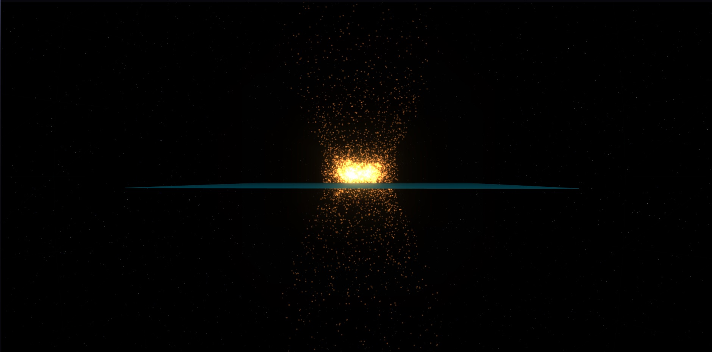
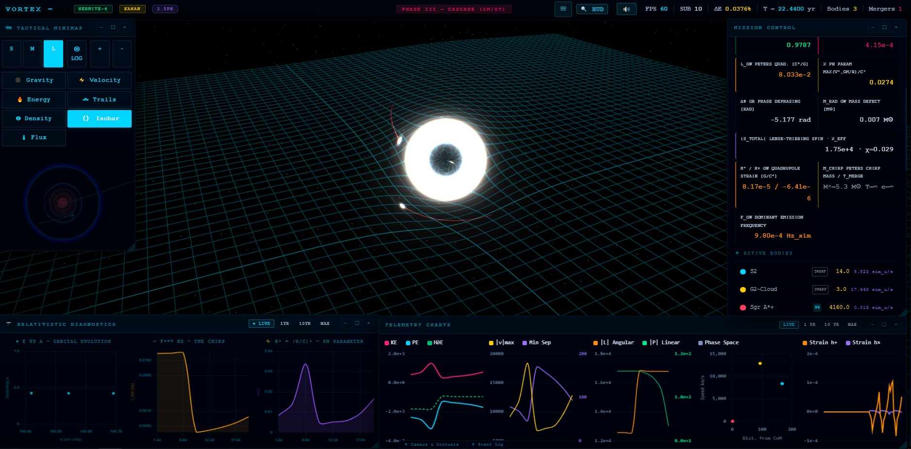
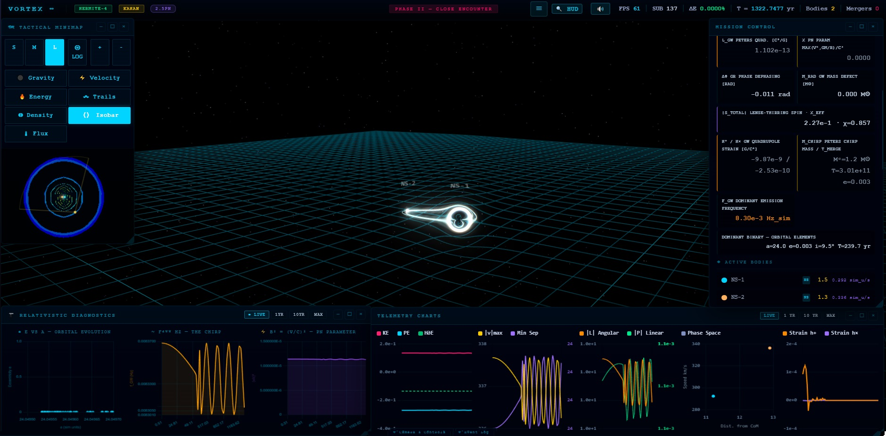
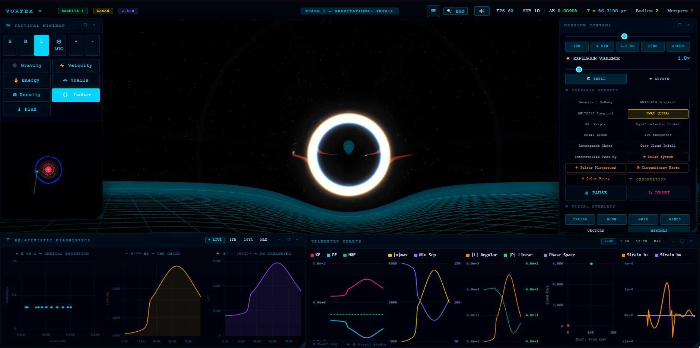
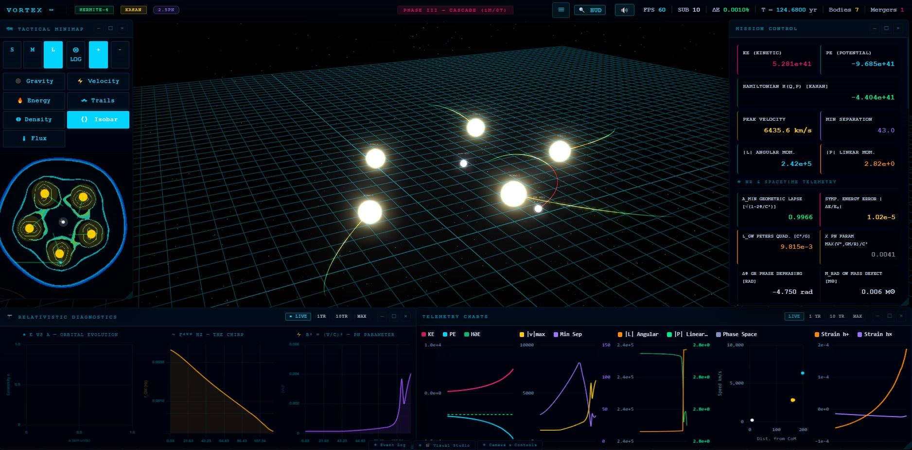
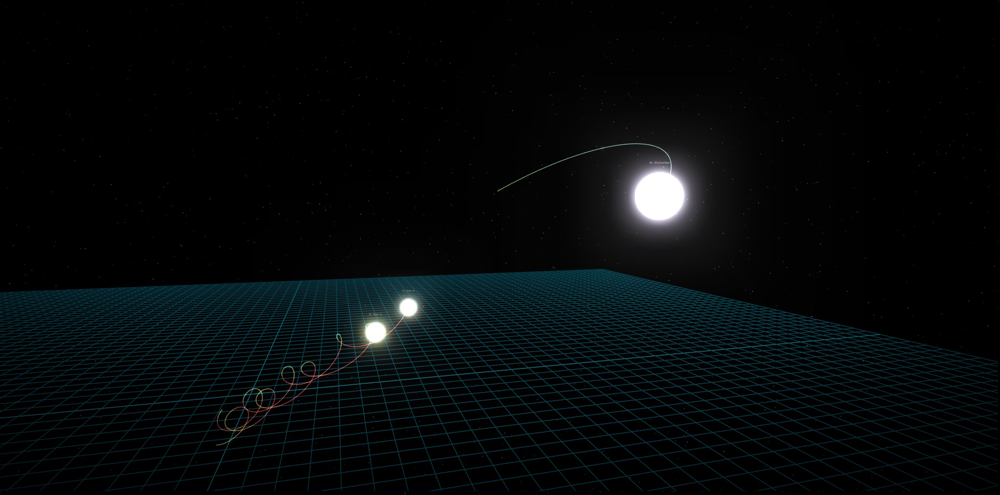
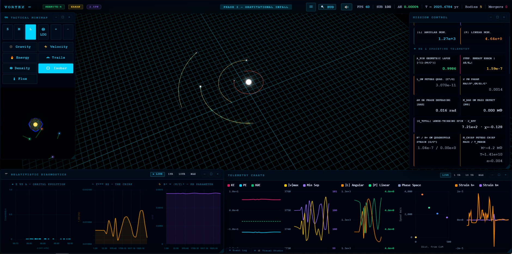
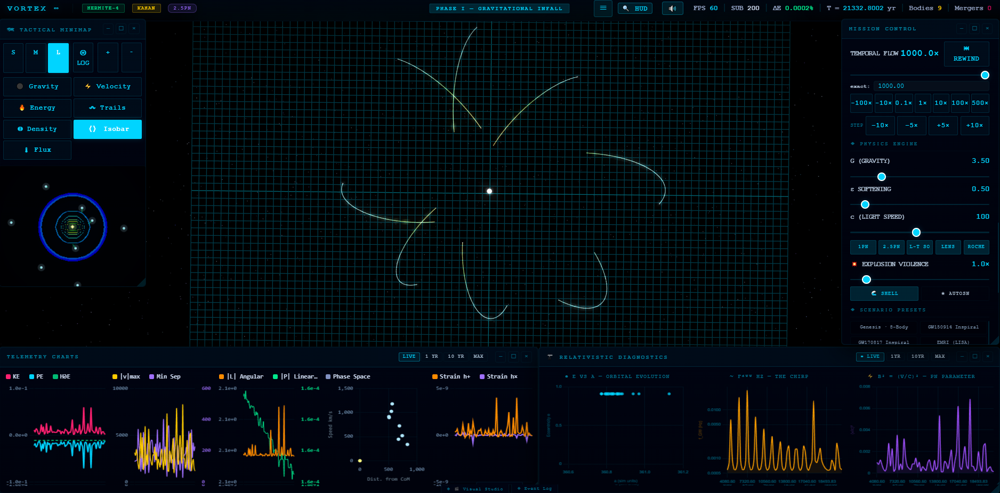

<div align="center">

# VORTEX ETERNITY

[](https://liranog.github.io/VORTEX/)
[]()
[](https://www.gnu.org/licenses/gpl-3.0)

[](https://github.com/LiranOG/VORTEX)
[](https://threejs.org/)

 **Interactive relativistic gravitational dynamics — running entirely in your browser.**

VORTEX ETERNITY is a single-file HTML/JavaScript application that makes relativistic gravitational physics interactive and inspectable in real time. It implements Post-Newtonian dynamics up to 2.5PN order, full gravitational-wave emission, and a suite of astrophysical preset scenarios
all rendered live with Three.js/WebGL.  

---

</div>

## 🌐 Live Demo

**[→ Launch VORTEX ETERNITY](https://liranog.github.io/VORTEX/)**

>**No installation. No dependencies to install. Open in any modern browser.**

---

## 📖 Extended Technical Documentation

This repository contains the standalone deployment of VORTEX ETERNITY.
A deeper technical README — covering the full architecture, zero-allocation
hot-path design, cinematic recording system, Tactical Minimap 3.0, and the
complete keyboard reference — is maintained inside the GRANITE-NR ecosystem:

**[→ VORTEX ETERNITY — Full Technical Documentation](https://github.com/LiranOG/Granite-NR/tree/main/viz/vortex_eternity)**

VORTEX serves as the interactive WebGL frontend for the GRANITE numerical
relativity engine, and its extended docs reflect that tighter integration
with the broader simulation ecosystem.

---

## ✨ Features

### Physics Engine
- **Hermite-4 integrator** with Kahan summation for energy stability
- **Post-Newtonian dynamics through 2.5PN** (radiation reaction / gravitational-wave back-reaction)
- **Rodrigues-formula spin precession** — geodetic and frame-dragging contributions
- **Kerr ISCO calculation** — innermost stable circular orbit for spinning black holes
- **Quasi-normal mode (QNM) ringdown** — frequency and damping time from remnant parameters
- **Gravitational-wave recoil kick** — asymmetric mass ejection velocity using the Campanelli formula
- **Solar System initialization from J2000.0 state vectors** — planets placed at physically correct positions

### Gravitational Wave Diagnostics
- Real-time GW strain (h₊, h×) computation via Peters quadrupole formula
- Live chirp frequency and energy/momentum loss tracking
- Accretion disk luminosity rendering (Novikov-Thorne model)
- CSV telemetry export for offline analysis

## Astrophysical Scenarios

| Scenario | Description |
|----------|-------------|
| **GW150914** | First detected binary black hole merger (LIGO 2015) — BH-36 + BH-29, M꜀=28.1M☉ |
| **GW170817** | Binary neutron star merger with kilonova (LIGO-Virgo 2017) — NS-1 + NS-2, M꜀=1.2M☉ |
| **EMRI (LISA)** | Extreme mass-ratio inspiral — Stellar-BH (10M☉) orbiting SMBH (1000M☉) |
| **ZKL Triple** | Kozai-Lidov eccentricity oscillations in a hierarchical triple system |
| **Galactic Center** | S2 star + G2 cloud cascade around Sgr A\* (4160M☉) |
| **Oort Cloud Infall** | Host-Star (300M☉) + 8-comet system in long-period eccentric infall |
| **N-body Cascade** | 7-body tri-species system — R136a1-class stars + compact objects |
| **Retrograde Chaos** | Counter-rotating multi-body system with chaotic orbital evolution |
| **Circumbinary Haven** | Stable and unstable orbits around a close binary pair |
| **Pulsar Playground** | Pulsar timing dynamics in a multi-body environment |
| **Solar System** | Full Solar System from J2000.0 state vectors — Sun through Neptune |
| **Interstellar Pass-by** | Hyperbolic stellar encounter with tidal perturbation |
| **Kosai-Lidov** | Extended KL oscillation suite with variable inclination |
| **TDE Encounter** | Tidal disruption event — stellar approach to compact object |
| **Solar Proxy** | Sun-like star with planetary system analog |
| **Total Eclipse** | Three-body eclipse geometry and shadow dynamics |
| **Binary Dance** | Choreographic binary with test-particle orbits |
| **Grand Alignment** | Multi-body syzygy and resonance configuration |

### Visualization
- Three.js-based 3D rendering with tactical minimap and HUD
- Real-time orbit trail rendering with fade
- Gravitational lensing approximation overlay
- Accretion disk geometry with Doppler color-shift

---

## 🛠 Technical Implementation

### Architecture
VORTEX ETERNITY is deliberately a **single self-contained HTML file**. This was a deliberate design constraint: zero build tooling, zero dependency management, instant deployment anywhere.

### Numerical Methods
The integrator uses a **4th-order Hermite predictor-corrector** scheme, which is standard in N-body astrophysics for its energy conservation properties. Kahan compensated summation is applied to accumulated forces to suppress floating-point drift over long integrations.

The Post-Newtonian expansion is implemented through **2.5PN order**, covering:
- **0PN** — Newtonian gravity
- **1PN** — Special-relativistic corrections (periapsis precession)
- **1.5PN** — Gravitomagnetic / spin-orbit coupling
- **2PN** — Conservative relativistic corrections  
- **2.5PN** — Radiation reaction (gravitational-wave energy loss)

> **Known open issue:** The 2PN conservative correction term is currently absent from the PN series — a gap identified during development and planned for a future revision. Energy drift remains below ~0.01% on the standard scenarios.

### Spin Dynamics
Spin precession is computed using the **Rodrigues rotation formula** applied per timestep, accumulating the geodetic (de Sitter) and frame-dragging (Lense-Thirring) contributions. This avoids gimbal lock while remaining computationally lightweight for real-time use.

---

## 🚀 Usage

### Run Locally
```bash
git clone https://github.com/LiranOG/VORTEX.git
cd VORTEX
# Open index.html in any modern browser
open index.html
```

No build step. No npm install. Just open the file.

### Controls
| Input | Action |
|-------|--------|
| Left drag | Rotate camera |
| Scroll | Zoom |
| Right drag | Pan |
| Scenario buttons | Load preset |
| CSV Export | Download telemetry |

---

## 🖼 Simulation Gallery
 
> All screenshots captured from live real-time runs. No post-processing applied.
> Physical quantities read directly from Mission Control HUD at moment of capture.
> **Physics scope:** VORTEX models pre-merger PN dynamics only. Visual explosion
> effects are cosmetic and do not represent NR merger physics.
 
---
 
### Stellar Explosion Visual Effect

Manually triggered particle explosion demonstrating VORTEX's visual rendering system.
The PN integrator continues running during the effect; ejecta particles interact
gravitationally with surrounding bodies. **Note: cosmetic only — not a physically
modeled merger event.**

---

### GW150914 — First Detected Binary Black Hole Merger

**BH-36 (36M☉) + BH-29 (29M☉)** · Phase II — CLOSE ENCOUNTER · T = 662.37 yr
 
| | |
|---|---|
| a = 60.2 · e = 0.003 · i = 14.0° · T_orb = 194.5 yr | M꜀ = 28.1M☉ · T_merge = 8.81×10⁸ yr |
| h₊ = −2.23×10⁻⁶ · h× = 3.04×10⁻⁷ G/c⁴ | f_GW = 1.03×10⁻² Hz · χ_eff = 0.161 |
| KE = 3.019×10³⁹ · PE = −6.054×10³⁹ | v_peak = 1073.0 km/s · Min Sep = 60.3 |
| A_min = 0.9998 · **ΔE = 5.28×10⁻⁹** · SUB = 10 | X_PN = 0.0004 · Δφ = 0.000 rad |
 
Exact LIGO component masses (Abbott et al. 2016). Quasi-circular inspiral (e=0.003)
consistent with original parameter estimation. Spacetime grid deformation driven by
combined 65M☉ at close encounter.

---

### GW170817 — Binary Neutron Star Merger

**NS-1 (1.5M☉) + NS-2 (1.3M☉)** · Phase II — CLOSE ENCOUNTER · T = 1322.75 yr
 
| | |
|---|---|
| a = 24.0 · e = 0.003 · i = 9.5° · T_orb = 239.7 yr | M꜀ = 1.2M☉ · T_merge = 3.01×10¹¹ yr |
| h₊ = −9.87×10⁻⁹ · h× = −2.53×10⁻¹⁰ G/c⁴ | f_GW = 8.30×10⁻³ Hz · χ_eff = 0.857 |
| X_PN ≈ 0.0000 · **ΔE = 0.0000%** · SUB = 137 | Δφ = −0.011 rad · L_GW = 1.102×10⁻¹³ |
 
First binary NS merger detected by LIGO-Virgo (2017). X_PN ≈ 0 and ΔE = 0.0000%
confirm extreme weak-field regime at this inspiral stage.
 
---
 
### SgrA\* Galactic Center — S2 Star + G2 Cloud Cascade

**Sgr A\* (4160M☉) + S2 (14M☉) + G2-Cloud (3M☉)** · Phase III — CASCADE · T = 22.44 yr · 1 Merger
 
| | |
|---|---|
| M꜀ = 5.3M☉ · GW Mass Defect = 0.007M☉ | h₊ = 8.17×10⁻⁵ · h× = −6.41×10⁻⁶ G/c⁴ |
| f_GW = 9.80×10⁻⁴ Hz · χ_eff = 0.029 | **X_PN = 0.0274** ← highest in gallery |
| **A_min = 0.9787** ← lowest in gallery | Δφ = −5.177 rad · ΔE = 4.15×10⁻⁴ |
 
Strongest relativistic corrections in this gallery — A_min = 0.9787 driven by 4160M☉
Sgr A\* at close encounter. Δφ = −5.177 rad represents significant accumulated precession.

---
 
### EMRI — Extreme Mass-Ratio Inspiral

**SMBH (1000M☉) + Stellar-BH (10M☉)** · Phase I · T = 86.31 yr
 
| | |
|---|---|
| a = 113.5 · e = 0.321 · i = 0.0° · T_orb = 127.9 yr | M꜀ = 63.0M☉ · T_merge = 3.89×10⁷ yr |
| h₊ = −1.04×10⁻⁶ G/c⁴ · f_GW = 1.25×10⁻² Hz | Δφ = −1.718 rad · χ_eff = 0.000 |
| A_min = 0.9973 · ΔE = 2.45×10⁻⁵ | v_peak = 6314.8 km/s · X_PN = 0.0027 |
 
The rosette orbital pattern is relativistic periapsis precession — a direct 1PN effect.
 
---
 
### N-body Cascade — 7-Body Tri-Species System

**7 bodies: R136a1-class stars + compact objects** · Phase III — CASCADE · T = 134.55 yr
 
| | |
|---|---|
| KE = 7.501×10⁴¹ · PE = −1.191×10⁴² | H(Q,P) = −4.409×10⁴¹ (Kahan) |
| v_peak = 5954.1 km/s · \|L\| = 2.41×10⁵ | GW Mass Defect = 0.006M☉ |
| A_min = 0.9966 · ΔE = 3.12×10⁻⁵ | L_GW = 3.170×10⁻² c⁵/G · Δφ = 3.958 rad |
 
Mission Control confirms energy conservation across the full cascade via Kahan-compensated Hamiltonian.
 
---
 
### ZKL Triple — Kozai-Lidov Hierarchical System

**KL-Star-A (200M☉) + KL-Star-B (180M☉) + KL-Disturber (800M☉)** · Cinematic mode
 
| | |
|---|---|
| a = 42.5 · e = 0.413 · i = 0.1° · T_orb = 47.7 yr | M꜀ = 165.1M☉ · T_merge = 3.69×10⁵ yr |
| h₊ = 3.09×10⁻⁴ · h× = 9.82×10⁻⁶ G/c⁴ | f_GW = 6.13×10⁻² Hz · Δφ = 0.052 rad |
| \|S_total\| = 1.96×10³ · χ_eff = −0.072 | Inner eccentricity pumped by 800M☉ disturber |
 
The KL mechanism drives periodic eccentricity oscillations in the inner binary via secular torque from the outer disturber.
 
---
 
### Gravitational Infall — 5-Body with Full GW Diagnostics

**5 bodies** · Phase I — GRAVITATIONAL INFALL · T = 2025.68 yr
 
| | |
|---|---|
| M꜀ = 4.2M☉ · T_merge = 1.41×10¹⁰ yr · e = 0.004 | h₊ = 1.04×10⁻⁷ G/c⁴ · Δφ = 0.016 rad |
| \|L\| = 1.27×10³ · \|P\| = 4.64 · χ_eff = −0.128 | X_PN = 0.0014 · L_GW = 3.070×10⁻¹¹ c⁵/G |
| A_min = 0.9986 · ΔE = 1.59×10⁻⁷ · SUB = 100 | Quasi-circular Peters regime (e ≈ 0) |
 
ΔE = 1.59×10⁻⁷ at SUB=100 — high-precision integration confirmed for early-phase encounter.
 
---
 
### Oort Cloud Infall — Host-Star + 8-Comet System

**Host-Star (300M☉) + Comet-1 through Comet-8** · Phase I · T = 21332.80 yr · Flow 1000×
 
| | |
|---|---|
| a = 412.8 · e = 0.889 · i = 26.1° · T_orb = 1626.1 yr | M꜀ = 0.2M☉ · T_merge = 1.70×10¹² yr |
| h₊ = −1.66×10⁻¹⁰ · h× = 1.41×10⁻¹¹ G/c⁴ | f_GW = 4.74×10⁻⁴ Hz · X_PN = 0.0002 |
| KE = 5.704×10³⁴ · PE = −1.135×10³⁶ | v_peak = 420.3 km/s · Min Sep = 527.6 |
| A_min = 0.9998 · **ΔE = 8.44×10⁻¹⁰** · SUB = 200 | Δφ = −1.604 rad · χ_eff = −0.103 |
 
**Highest-precision run in this gallery** — ΔE = 8.44×10⁻¹⁰ at SUB=200. The extreme
merger timescale (1.70×10¹² yr) confirms purely Newtonian-regime dynamics with negligible GW inspiral.
 
---
 
> Full per-scenario documentation with extended physical analysis:
> **[→ assets/README.md](assets/README.md)**

---

## 📊 Telemetry Export

VORTEX exports real-time simulation data as CSV, including:
- Timestep, simulation time
- Per-body: position (x,y,z), velocity (vx,vy,vz), mass, spin
- GW strain (h₊, h×), chirp frequency
- Total energy, angular momentum, energy drift %

This allows offline analysis with Python/NumPy or any data tool.

---

## 🔭 Development Methodology

VORTEX ETERNITY was developed through **AI-orchestrated implementation** — directing model-generated code against published formulae (Peters 1964, Blanchet 2014, Campanelli 2007), then auditing, integrating, and verifying numerical behavior.

This is an engineering and learning project rather than credentialed research. Its value lies in hands-on intuition for relativistic two-body dynamics and the practical challenges of real-time scientific visualization.

---

## 📚 References

- Peters, P.C. (1964). *Gravitational Radiation and the Motion of Two Point Masses*. Physical Review.
- Blanchet, L. (2014). *Gravitational Radiation from Post-Newtonian Sources*. Living Reviews in Relativity.
- Campanelli, M. et al. (2007). *Maximum Gravitational Recoil*. Physical Review Letters.
- Buonanno, A. & Damour, T. (1999). *Transition from inspiral to plunge in binary black hole coalescences*. Physical Review D.

---

## 🤝 Contributing

See [CONTRIBUTING.md](CONTRIBUTING.md) for guidelines.

Pull requests are welcome, particularly for:
- The missing 2PN conservative correction
- Additional PN orders (3PN, 3.5PN)
- Additional astrophysical scenarios
- Performance optimizations for the integrator

---

## 📄 License

GPL 3.0 License — see [LICENSE](LICENSE) for details.

---

## 👤 Author

**Liran Schwartz** · [LinkedIn](https://linkedin.com/in/liran-schwartz) · [ORCID](https://orcid.org/0009-0008-8035-1308) · [GitHub](https://github.com/LiranOG)

*Part of an ongoing independent research program in computational physics and AI systems.*
